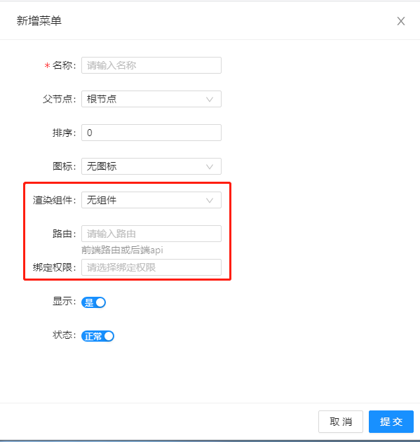

# 开箱功能

## 简介
系统内置了管理员管理、权限系统、菜单管理、系统配置、操作日志、附件管理等开箱即用的实用功能

## 管理组

### 管理员
系统内置了管理员管理，默认的超级管理员是 `administrator` ，默认密码是 `123456`（特别注意一定要更改默认密码）你可以添加管理员，并且给管理员赋予角色进行后台管理

### 角色
通过角色管理你可以，灵活的给角色赋予菜单的权限。
::: danger
特别注意：当您在给角色赋予菜单的管理权限之前，你需要对每个菜单绑定权限！！！否则角色无法分配菜单权限！！！
:::

### 权限
你可以点击同步权限，将admin.php路由下的所有路由配置添加到数据库的权限表中，注意同步的时候可能会比较慢，你可以耐心的等待一下；QuarkAdmin的权限统一约定为路由的名称，例如： `$router->get('admin/admin/index', 'AdminController@index')->name('api/admin/admin/index');` 这个路由，插入权限表的数据为：`api/admin/admin/index`

## 菜单管理
你可以在后台管理系统的菜单

### 添加菜单

#### 渲染组件
添加菜单的时候需要特别注意 `渲染组件` 的选择，当你准备用系统提供的引擎渲染页面的时候，你需要选择`引擎组件`；当你准备自己通过QuarkUI写前端页面的时候你可以选择`无组件`

#### 路由
当 `渲染组件` 表单项选择 `引擎组件` 的时候，你需要填写返回数据的api接口，例如：`admin/admin/index`，这里不用加`api`这个前缀；当 `渲染组件` 选择 `无组件` 的时候，你需要填写QuarkUI前端定义的路由，例如：`/account`

#### 绑定权限
你可以给菜单绑定权限，注意如果你不绑定权限，角色将无法分配菜单权限！

## 系统配置
系统提供了一个便捷的配置管理，方便系统开发，你可以通过 `web_config` 助手函数快速的读取配置的值

## 操作日志
系统内置了一个操作日志的记录，查看各种操作记录

## 附件管理
系统中上传文件、上传图片均有一个对应的数据表进行管理，你可以通过附件管理方便的查看上传的文件信息