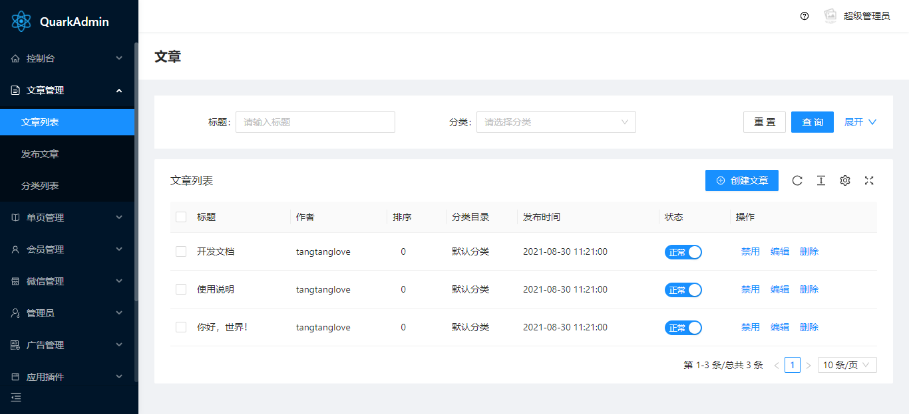
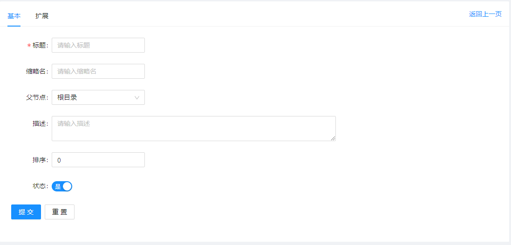

# 资源

## 基础

QuarkAdmin 是一款 Laravel 应用程序的后台管理面板。当然，QuarkAdmin 的主要功能是使用 Eloquent 管理底层数据库记录。我们需要在应用中定义一个与 Eloquent 模型对应的「资源」实现此目标。


### 定义资源

QuarkAdmin 资源默认存储在应用的`app/Admin`文件夹。你可以使用`quarkadmin:resource`Artisan 命令生成一个新资源：

```bash
php artisan quarkadmin:resource Post
```

资源的基本属性是`model`属性。此属性告诉 QuarkAdmin 该资源对应的 Eloquent 模型：

```php
/**
 * 资源对应的模型。
 *
 * @var string
 */
public static $model = 'App\Post';
```

新创建的 QuarkAdmin 资源只包含一个`ID`字段定义。别担心，我们很快会为我们的资源添加更多字段。


一旦你的资源用 QuarkAdmin 创建完毕，你可以打开`http://www.yoursite.com/admin/#/index?api=admin/post/index`中访问；如需在侧边栏显示，在菜单中添加相关信息即可：




### 页面标题

可以通过资源的`title`属性设置页面标题：

```php
/**
 * 页面标题
 *
 * @var string
 */
public static $title = '文章';
```

### 列表分页

通过资源的`perPage`属性设置每页数量或者关闭分页，当值为`false`时，即关闭了列表分页功能：

```php
/**
 * 分页
 *
 * @var int|bool
 */
public static $perPage = 10;
```


## 字段

### 定义字段

每个 QuarkAdmin 资源均包含一个`fields`方法。QuarkAdmin 提供了各种开箱即用的字段，包括文本输入、布尔、日期、文件上传 等多种字段。

要向资源添加字段，我们只需将它加入到资源的`fields`方法内。此方法会接受几个参数；但是，通常只需传递一个「易于阅读的」字段名称。Nova 对此名称应用「蛇形命名法（下划线命名法）」以确定对应的底层数据库列：

```php
use QuarkCMS\QuarkAdmin\Field;

/**
 * 获取资源显示的字段。
 *
 * @param  \Illuminate\Http\Request  $request
 * @return array
 */
public function fields(Request $request)
{
    return [
        Field::hidden('id'),
        Field::text('title'),
        Field::text('source')
    ];
}
```


#### 字段列名约定

如上所述，QuarkAdmin 对字段的展示名称应用「蛇形命名法（下划线命名法）」 ，以确定底层的数据库列。但如果需要，你可以将列名作为第二个参数传递给字段的初始化方法：

```php
Field::text('title','标题');
```


### 显示 / 隐藏字段

你经常会在某些场景下只想显示某个字段。例如，你通常有一个在查询列表中无需显示的`Password`字段。同样地，你也想在「创建 / 更新表单」里只显示`Created At`字段。Nova 可以轻松实现在屏幕上显示 / 隐藏字段。

下面的方法可在显示的上下文里展示 / 隐藏字段：

- `hideFromIndex`
- `hideFromDetail`
- `hideWhenCreating`
- `hideWhenUpdating`
- `onlyOnIndex`
- `onlyOnDetail`
- `onlyOnForms`
- `exceptOnForms`

你可以在字段定义时链式调用这些方法，以指示 Nova 在哪里可以显示 / 隐藏字段：

```php
Text::make('Name')->hideFromIndex()
```


### 标签面板

如果你的资源包含很多字段，屏幕上资源的内容会很拥挤。鉴于此，你可以选择把字段组拆分到它们自己的「Tab」里：



你也可以通过在资源的`fields`方法里创建一个`TabPane`实例实现此目的。每个`TabPane`实例需要一个名称和一个属于它的字段数组：

```php
use QuarkCMS\Quark\Facades\TabPane;

/**
 * 获取资源要展示的字段。
 *
 * @param  \Illuminate\Http\Request  $request
 * @return array
 */
public function fields(Request $request)
{
    return [
        (TabPane::make('基本', $this->baseFields())),
        (TabPane::make('扩展', $this->extendFields()))
    ];
}

/**
 * 获取资源的基本字段。
 *
 * @return array
 */
protected function baseFields()
{
    return [
            Field::hidden('id','ID'),
            Field::text('title','标题'),
            Field::text('author','作者'),
            Field::text('source','来源'),
            Field::text('description','描述'),
            Field::editor('content','内容')
    ];
}

/**
 * 获取资源的扩展字段。
 *
 * @return array
 */
protected function extendFields()
{
    return [
        Field::text('name','缩略名'),
        Field::number('level','排序'),
        Field::number('view','浏览量'),
        Field::number('comment','评论量')
    ];
}
```


### 可编辑字段

当向资源添加一个字段时，你可以使用`editable`方法指定列表上的字段为可编辑状态：

```php
Field::text('name_column','Name')->editable();
```

### 字段默认值

可以通过`default`方法，给表单里的字段赋值：

```php
Field::text('name_column','Name')->default('hello');
```

### 设置保存值

`value`方法与`default`方法效果相似，不同的是当你点击重置表单的时候，会重置成`default`方法设置的值：
::: tip
注意：如果你同时使用`default()`方法和`value()`方法给字段赋值，`value()`方法设置的值会冲掉`default()`设置的值
:::
```php
Field::text('name_column','Name')->value('hello');
```

### 字段提示信息

可以通过`help`，`extra`方法，给表单里的字段设置提示信息：

```php
Field::text('name_column','Name')->help('help...');

// 或者
Field::text('name_column','Name')->extra('help...');
```

### 字段占位符

可以通过`placeholder`方法，设置表单里字段的占位符：

```php
Field::text('name_column','Name')->placeholder('请输入。。。');
```

### 设置必填

通过`required`方法，设置表单字段为必填项：

```php
Field::text('name_column','Name')->required();
```

### 禁用字段

可以通过`disabled`方法，禁用表单里的字段：

```php
Field::text('name_column','Name')->disabled();
```

### 字段类型

QuarkAdmin 提供了丰富的字段类型。那么，让我们浏览一下所有的类型和相应选项：

#### 隐藏域（hidden）字段

`hidden`字段可以用于不需要展示，但是却需要提交的表单项，例如 `id`等：

```php
Field::hidden('id','ID');
```

#### 文本输入（text）字段

`Text` 字段提供了一个 `type` 属性为 `text` 的 `input` 字段：

```php
Field::text($column, [$label]);

// 添加占位符
Field::text($column, [$label])->placeholder('text');

// 带标签的 input，设置后置标签。例如：'http://'
Field::text($column, [$label])->addonAfter('http://');

// 带标签的 input，设置前置标签。例如：'.com'
Field::text($column, [$label])->addonAfter('.com');

// 最大长度
Field::text($column, [$label])->maxLength(20);

// 字段大小。注：标准表单内的输入框大小限制为 large。可选 large default small
Field::text($column, [$label])->size('default');

// 可以点击清除图标删除内容
Field::text($column, [$label])->allowClear();

// 输入框宽度
Field::text($column, [$label])->width(100);
```

#### 文本域（textarea）字段

`textarea` 字段提供一个 `textarea` 字段：

```php
// 添加占位符
Field::textarea($column, [$label])->placeholder('text');

// 行数
Field::textarea($column[, $label])->rows(10);

// 宽度
Field::textarea($column, [$label])->width(100);
```

#### 单选（radio）字段

`radio` 字段提供一个 `radio` 字段：

``` php
Field::radio($column[, $label])->options(['m' => 'Female', 'f'=> 'Male'])->default('m');

Field::radio($column[, $label])->options(['m' => 'Female', 'f'=> 'Male'])->value('m');
```

#### 多选（checkbox）字段

`checkbox` 字段提供一个 `checkbox` 字段：

``` php
Field::checkbox($column[, $label])->options([
    1 => 'foo',
    2 => 'bar',
    'val' => 'Option name'
]);
```

#### 下拉框（select）字段

`select` 字段用于生成下拉选择菜单。可以使用 `options` 方法定义菜单选项：

``` php

// 单选模式
Field::select($column[, $label])->options([
    1 => 'foo',
    2 => 'bar',
    'val' => 'Option name'
]);

// 多选模式
Field::select($column[, $label])
->mode('multiple')
->options([
    1 => 'foo',
    2 => 'bar',
    'val' => 'Option name'
]);

// tags模式
Field::select($column[, $label])
->mode('tags')
->options([
    1 => 'foo',
    2 => 'bar',
    'val' => 'Option name'
]);
```

##### 下拉框（select）字段联动

``` php

// 下拉框联动
Field::selects([
    // 下拉框联动
    Field::select('province', '省')
    ->options([
        1 => '北京',
        2 => '天津',
        3 => '河北省'
    ])
    ->load('city','admin/area/cities'),

    // 市
    Field::select('city', '市')
]);
```

##### 下拉框联动的接口代码示例

``` php
public function cities(Request $request)
{
    // 获取参数
    $pid = $request->input('search');

    // 获取数据
    $options = Area::where('pid',$pid)->select('id as value','area_name as label')->get()->toArray();

    return success('获取成功','',$options);
}
```

#### 日期时间（date）字段

`date` 字段提供一个 `picker` 方法，来设置选择器类型：

``` php

Field::date($column[, $label]);

// 周选择器，picker方法的参数为 date | week | month | quarter | year
Field::date($column[, $label])->picker('week');
```

#### 日期范围（dateRange）字段
$startDate、$endDate为开始和结束日期，`dateRange` 字段提供一个 `picker` 方法，来设置选择器类型：
``` php
Field::dateRange($column[, $label])->value([$startDate,$endDate]);

// 周选择器，picker方法的参数为 date | week | month | quarter | year
Field::dateRange($column[, $label])->picker('week')->value([$startDate,$endDate]);
```

#### 日期时间（datetime）字段
``` php

Field::datetime($column[, $label]);
```

#### 时间日期范围（datetimeRange）字段
$startDateTime、$endDateTime为开始和结束时间日期:
``` php
Field::datetimeRange($column[, $label])->value([$startDateTime,$endDateTime]);
```

#### 时间（time）字段
``` php
Field::time($column[, $label]);
```

#### 时间范围（timeRange）字段
$startTime、$endTime为开始和结束时间:
``` php
Field::timeRange($column[, $label])->format('HH:mm')->value([$startTime,$endTime]);
```

#### 周（week）字段
注意数据库字段需为字符串类型
``` php

Field::week($column[, $label]);
```

#### 月（month）字段
注意数据库字段需为字符串类型
``` php

Field::month($column[, $label]);
```

#### 季度（quarter）字段
注意数据库字段需为字符串类型
``` php

Field::quarter($column[, $label]);
```

#### 年（year）字段
注意数据库字段需为字符串类型
``` php

Field::year($column[, $label]);
```

#### 数字输入（number）字段
``` php
Field::number($column[, $label]);

// 设置最大值
Field::number($column[, $label])->max(100);

// 设置最小值
Field::number($column[, $label])->min(10);

// 步进值
Field::number($column[, $label])->step(1);
```

#### 富文本编辑器（editor）
``` php
Field::editor($column[, $label])->height(500)->width(600);
```

#### 开关（switch）字段
trueValue和falseValue对应开关的两个值 `true` 和 `false`:
``` php
Field::switch('comment_status','允许评论')
->editable()
->trueValue('是')
->falseValue('否')
->default(true)
```

#### 纯展示
只显示文字，不做任何操作：
``` php
Field::display($label);
```

#### 图标选择（icon）字段
``` php
Field::icon($column[, $label]);
```

#### 级联选择（cascader）字段
``` php
$options = [
  [
    'value' => 'zhejiang',
    'label' => 'Zhejiang',
    'children' => [
      [
        'value' => 'hangzhou',
        'label' => 'Hangzhou'
      ]
    ]
  ]
];

Field::cascader($column[, $label])->options($options);

// 通过ajax获取数据
$options = Area::where('level',1)->select('id as value','area_name as label')->get()->toArray();

// 通过isLeaf属性设定是否有下一级
foreach ($options as $key => $value) {
    $options[$key]['isLeaf'] = false;
}

Field::cascader($column[, $label])->options($options)->api('admin/area/suggest');
```

##### 级联选择的接口代码示例
``` php
public function suggest(Request $request)
{
    // 获取参数
    $pid = $request->input('search');

    // 当前层级
    $level = $request->input('level');

    // 获取数据
    $options = Area::where('pid',$pid)->select('id as value','area_name as label')->get()->toArray();
    
    // 设定层级超过2后，不在获取数据
    if($level < 2) {
        foreach ($options as $key => $value) {
            $options[$key]['isLeaf'] = false;
        }
    }

    return success('获取成功','',$options);
}
```

#### 搜索（search）字段
``` php
Field::search($column[, $label])->options([1 => 'foo', 2 => 'bar', 'val' => 'Option name']);

// 多个选择
Field::search($column[, $label])->mode('multiple')->options([1 => 'foo', 2 => 'bar', 'val' => 'Option name']);

// 通过ajax获取数据
Field::search($column[, $label])->api('/api/user/suggest');
```

##### 搜索选择的接口代码示例
``` php
public function suggest(Request $request)
{
    // 获取参数
    $search = $request->input('search');

    // 获取类型：当type为'value'时，search传入的为下拉框的值;当type为'label'时，search传入的为下拉框的文本
    $type = $request->input('type','label');
    
    // 定义对象
    $query = User::query();

    if($type === 'label') {
        // 查询用户名
        if(!empty($search)) {
            $query->where('nickname','like','%'.$search.'%');
        }
    } elseif($type === 'value') {
        if(!empty($search)) {
            $query->where('id', $search);
        }
    }

    // 查询列表
    $users = $query
    ->limit(20)
    ->where('status', '>', 0)
    ->orderBy('id', 'desc')
    ->select('nickname as label','id as value')
    ->get()
    ->toArray();

    return success('获取成功！','',$users);
}
```

#### 树型选择（tree）字段
``` php
$treeData = [
  [
    'title' => 'Node1',
    'value' => '0-0',
    'children' => [
      [
        'title' => 'Child Node1',
        'value' => '0-0-1',
      ],
      [
        'title' => 'Child Node2',
        'value' => '0-0-2',
      ],
    ],
  ],
  [
    'title' => 'Node2',
    'value' => '0-1',
  ]
];

Field::tree($column[, $label])->data($treeData);
```

#### 地图坐标选择（map）字段
``` php
Field::map($column[, $label])->style(['width'=>'100%','height'=>400])->position($longitude,$latitude);
```

#### 地理围栏（geofence）字段
``` php

$longitude = 116.397724;
$latitude = 39.903755;

$points = [
    ['longitude'=> bcadd($longitude,0.005,6), 'latitude'=> bcadd($latitude,0.005,6) ],
    ['longitude'=> bcadd($longitude,0.005,6), 'latitude'=> bcsub($latitude,0.005,6) ],
    ['longitude'=> bcsub($longitude,0.005,6), 'latitude'=> bcsub($latitude,0.005,6) ],
    ['longitude'=> bcsub($longitude,0.005,6), 'latitude'=> bcadd($latitude,0.005,6) ]
];

Field::geofence($column[, $label])
->style(['width'=>'100%','height'=>400])
->center($longitude,$latitude) // 中心点
->points($points); // 多边形围栏坐标点

```

#### 图片上传（image）字段
``` php
Field::image($column[, $label]);

// 多图上传，默认数据库保存json格式数据，model可选 'multiple' | 'single' 或者缩写 'm' | 's'
Field::image($column[, $label])->mode('multiple');

// 上传button文字
Field::image($column[, $label])->button('上传图片');

// 上传数量限制，默认3个文件
Field::image($column[, $label])->limitNum(4);

// 上传文件大小限制，默认2M
Field::image($column[, $label])->limitSize(20);

// 上传文件类型限制，类型支持后缀方式，例如['jpeg','png']这样的数组也是可以的
Field::image($column[, $label])->limitType(['image/jpeg','image/png']);

// 上传尺寸限制，第一个参数是显的宽度，第二个参数是限定的高度
Field::image($column[, $label])->limitWH(200，200);
```

#### 文件上传（file）字段
``` php
Field::file($column[, $label]);

// 上传button文字
Field::file($column[, $label])->button('上传附件');

// 上传数量限制，默认3个文件
Field::file($column[, $label])->limitNum(4);

// 上传文件大小限制，默认2M
Field::file($column[, $label])->limitSize(20);

// 上传文件类型限制，类型支持后缀方式，例如['jpeg','png']这样的数组也是可以的
Field::file($column[, $label])->limitType(['image/jpeg','image/png']);
```

#### 嵌套表单字段（list）字段
``` php
Field::list($column[, $label])->button('添加数据')->item(function () {
	Field::text($column, [$label]);
	...
});

// 实例
Field::list($column[, $label])
->button('添加数据','bottom')
->item(function () {
    return Field::group([
        Field::text('title','奖品名称'),

        Field::number('num','奖品数量'),

        Field::number('probability','中奖概率')
    ]);
});
```

## 表单联动
表单联动是指，在选择表单项的指定的选项时，联动显示其他的表单项。

### 文本框字段
``` php
Field::text('column')->when('hello', function ($form) {
    return Field::select('options')->options();
});
```

### 单选字段
``` php
Field::radio('nationality', '国籍')->options([
    1 => '本国',
    2 => '外国',
])->when(1, function ($form) { 
    return [
        Field::text('name', '姓名'),
        Field::text('idcard', '身份证')
    ];
})->when(2, function ($form) { 
    return [
        Field::text('name', '姓名'),
        Field::text('passport', '护照')
    ]
});
```
上例中，方法`when(1, $callback)`等效于`when('=', 1, $callback)`, 如果用操作符`=`，则可以省略这个参数，同时也支持这些操作符 `=`、`>`、`>=`、`<`、`<=`、`!=`、`in`、`notIn` 使用方法如下：
``` php
Field::radio('check')->when('>', 1, function () {

})->when('>=', 2, function () {

})->when('in', [5, 6], function () {

})->when('notIn', [7, 8], function () {

});
```

## 表单验证

### 通用规则
Form组件使用Laravel的验证规则来验证表单提交的数据：
``` php
Field::text('title','标题')->rules(
    ['required','min:6','max:20'],
    ['required'=>'标题必须填写','min'=>'标题不能少于6个字符','max'=>'标题不能超过20个字符']
);
```

### 创建页规则
创建页面规则，只在创建表单提交时生效
``` php
Field::text('username','用户名')->creationRules(
    ["unique:admins"],
    ['unique'=>'用户名已经存在']
);
```

### 编辑页规则
更新页面规则，只在更新表单提交时生效
``` php
Field::text('username','用户名')->updateRules(
    ["unique:admins,username,{id}"],
    ['unique'=>'用户名已经存在']
);
```

### 数据库unique检查
一个比较常见的场景是提交表单是检查数据是否已经存在，可以使用下面的方式：
``` php
Field::text('username','用户名')
->creationRules(["unique:admins"],['unique'=>'用户名已经存在'])
->updateRules(["unique:admins,username,{id}"],['unique'=>'用户名已经存在']);
```

## 回调函数
目前提供了`beforeIndexShowing`、`beforeCreating`、`beforeEditing`、`beforeSaving`、`afterSaved`几个回调函数，用来重写数据、反馈等操作


### 列表展示前回调

可以通过此方法重写列表数据

``` php
/**
 * 列表页面显示前回调
 * 
 * @param Request $request
 * @param mixed $list
 * @return array
 */
public function beforeIndexShowing(Request $request, $list)
{
    // 转换成树形表格
    return !isset($request->search) ? list_to_tree($list,'id','pid','children', 0) : $list;
}
```

### 创建展示前回调

可以通过此方法给创建页表单赋值

``` php
/**
 * 创建前回调
 * 
 * @param Request $request
 * @return array
 */
public function beforeCreating(Request $request)
{
    $admin = \QuarkCMS\QuarkAdmin\Models\Admin::where('id',ADMINID)->first();

    // 初始化数据
    return [
        'author' => $admin['nickname'],
        'level' => 0,
        'view' => 0,
        'show_type' => 1,
        'comment' => 0,
        'status' => true,
        'comment_status' => true
    ];
}
```

### 编辑展示前回调

可以通过此方法给编辑页表单赋值

``` php
/**
 * 编辑前回调
 *
 * @param  Request  $request
 * @param  array $data
 * @return object
 */
public function beforeEditing(Request $request, $data)
{
    // 查询角色
    $roles = Role::where('guard_name','admin')->get()->toArray();
    $admin = static::newModel()->find($request->id);

    foreach ($roles as $role) {
        $hasRole = $admin->hasRole($role['name']);
        if($hasRole) {
            $roleIds[] = $role['id'];
        }
    }

    $data['role_ids'] = $roleIds ?? [];

    // 编辑的时候，不显示密码
    unset($data['password']);

    return $data;
}
```

### 保存前回调
``` php
/**
 * 保存前回调
 *
 * @param  Request  $request
 * @param  array $submitData
 * @return object
 */
public function beforeSaving(Request $request, $submitData)
{
    if(isset($submitData['password'])) {
        $submitData['password'] = bcrypt($submitData['password']);
    }

    return $submitData;
}
```

### 保存后回调
你可以在保存成功后，进行进一步其他操作或根据不同的结果进行响应
``` php
/**
 * 保存后回调
 *
 * @param  Request  $request
 * @return object
 */
public function afterSaved(Request $request, $model)
{
    return $model->syncRoles($request->role_ids);
}
```