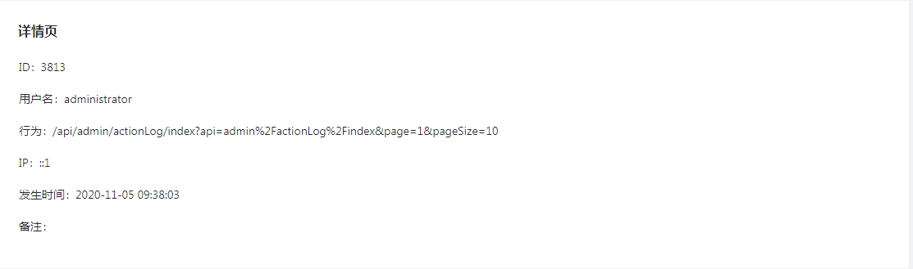
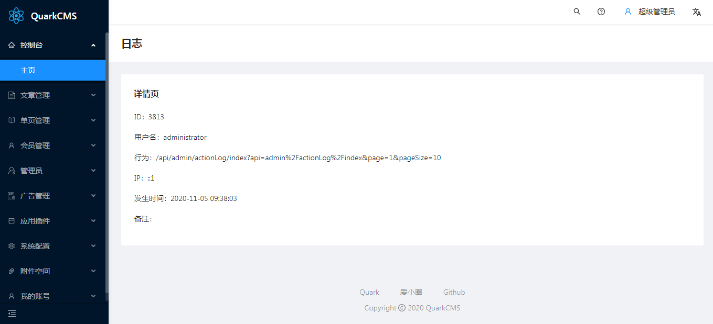

# 详情组件


## 简介
通过 QuarkAdmin 的 Show 组件您可以创建一个漂亮、简洁、功能齐全的详情页。

#### 效果预览


## 快速入门
在Table组件章节已经介绍过了，QuarkAdmin 的各组件初始化相对比较统一，我们下面看一下简单的用法：
``` php
<?php

namespace App\Http\Controllers\Admin;

use App\Models\ActionLog;
use Quark;
use QuarkCMS\QuarkAdmin\Http\Controllers\Controller;

class ActionLogController extends Controller
{
    protected function detail($id)
    {
        $show = Quark::show(ActionLog::findOrFail($id)->toArray());

        $show->title('详情页');
        $show->field('id','ID');
        $show->field('object_id','用户名');
        $show->field('url','行为');
        $show->field('ip','IP');
        $show->field('created_at','发生时间');
        $show->field('remark','备注');

        return $show;
    }
}
```
在所有Show组件使用的文档里，示例控制器都应继承`QuarkCMS\QuarkAdmin\Http\Controllers\Controller`类，`$show` 是指 `Quark::show()` 得到的实例，这里就不在每个页面单独写了。

#### 下面我们正式开启Show组件的使用旅程：
我们用下面的代码生成日志表action_logs的表单页：

``` php
use App\Models\ActionLog;
use Quark;

$show = Quark::show(ActionLog::findOrFail($id)->toArray());

$show->title('详情页');
$show->field('id','ID');
$show->field('object_id','用户名');
$show->field('url','行为');
$show->field('ip','IP');
$show->field('created_at','发生时间');
$show->field('remark','备注');

```
配置好相应的[路由]()、[菜单]()后，点开我们新添加的菜单就可以看到如下页面：



## 基本使用

### 初始化详情组件
你可以通过Quark门面快速实例化一个Show对象
``` php
Quark::show(ActionLog::findOrFail($id)->toArray());
```

### 标题
可以通过`title()`方法来设置详情的标题
``` php
$show->title('友情链接');
```

### 内容的补充描述
内容的补充描述，hover 后显示
``` php
$show->tooltip('友情链接');
```

### 边框
是否展示边框
``` php
$show->bordered();
```

### 表单布局
表单布局，`'horizontal'` | `'vertical'`
``` php
$show->layout('vertical');
```

### 行数量
一行的 `ProDescriptionsItems` 数量，可以写成像素值或支持响应式的对象写法 `{ xs: 8, sm: 16, md: 24}`，默认`1`
``` php
$show->column(2);
```

### 设置列表大小
设置列表的大小。可以设置为 `'middle'` 、`'small'`, 或不填（只有设置 `bordered={true}` 生效）,`'default'` | `'middle'` | `'small'`
``` php
$show->size('middle');
```

### 填充数据
您可以自定义填充数据
``` php
$show->initialValues($data);
```

## 展示控件
在Show组件中暂时内置了`field`控件

### 字段（field）控件
``` php
$show->field('id','ID');
```

#### 设置默认值
``` php
$show->field('title','标题')->default('text...');
```

#### 设置保存值
::: tip
注意：如果你同时使用`default()`方法和`value()`方法给字段赋值，`value()`方法设置的值会冲掉`default()`设置的值
:::

``` php
$show->field('title','标题')->value('text...');
```

#### 设置提示信息
``` php
$show->field('title','标题')->help('help...');

// 或者
$show->field('title','标题')->extra('help...');
```

#### 图片字段
``` php
$show->field('title','标题')->image();
```

#### 链接字段
``` php
$show->field('title','标题')->link($href = null, $target = '_self');
```