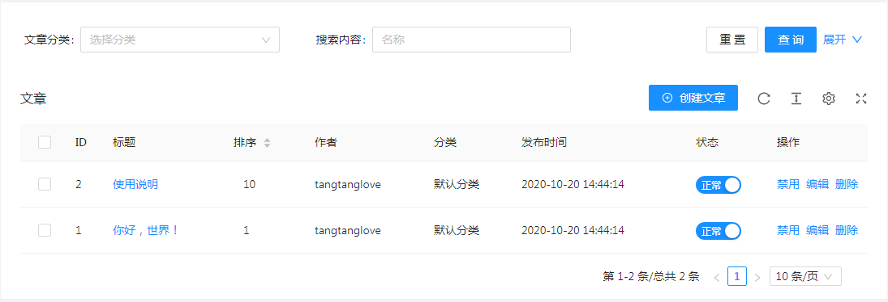

# 表格组件

## 简介
通过 QuarkAdmin 的 Table 组件您可以创建一个漂亮、简洁、功能齐全的列表页。每个 Table 组件都可以对应一个「模型」用来与该表交互。你可以通过模型查询数据表中的数据，以及对数据的增、删、改、查。

#### 效果预览

## 快速入门
QuarkAdmin 的各组件初始化相对比较统一，用法如下：
``` php
<?php

namespace App\Http\Controllers\Admin;

use App\Models\Link;
use Quark;
use QuarkCMS\QuarkAdmin\Http\Controllers\Controller;

class LinkController extends Controller
{
    protected function table()
    {
        $table = Quark::table(new Link)->title($this->title);
        ...
        return $table;
    }
}
```
在所有Table组件使用的文档里，示例控制器都应继承`QuarkCMS\QuarkAdmin\Http\Controllers\Controller`类，`$table` 是指 `Quark::table()` 得到的实例，这里就不在每个页面单独写了。


#### 下面我们正式开启Table组件的使用旅程：

第一步、首先我们先创建一张数据表，下面以友情链接（links）表为例：
``` sql
CREATE TABLE `links` (
  `id` int(10) unsigned NOT NULL AUTO_INCREMENT,
  `sort` int(11) DEFAULT '0',
  `title` varchar(255) COLLATE utf8mb4_unicode_ci NOT NULL COMMENT '标题',
  `url` varchar(255) COLLATE utf8mb4_unicode_ci NOT NULL COMMENT '访问地址',
  `cover_id` longtext COLLATE utf8mb4_unicode_ci COMMENT '封面图',
  `status` tinyint(1) NOT NULL DEFAULT '1',
  `created_at` timestamp NULL DEFAULT NULL,
  `updated_at` timestamp NULL DEFAULT NULL,
  PRIMARY KEY (`id`)
) ENGINE=InnoDB AUTO_INCREMENT=4 DEFAULT CHARSET=utf8mb4 COLLATE=utf8mb4_unicode_ci;
```

第二步、为对应的 links 数据表创建模型 `App\Models\Link` [示例代码](https://github.com/quarkcms/quark-cms/blob/master/app/Models/Link.php)

第三步、用下面的代码生成友情链接表links的列表页 [示例代码](https://github.com/quarkcms/quark-cms/blob/master/app/Http/Controllers/Admin/LinkController.php#L19)：
``` php
use App\Models\Link;
use Quark;

$table = Quark::table(new Link)->title($this->title);
$table->column('id','ID');
$table->column('title','标题')->editLink();
$table->column('sort','排序')->sorter()->editable()->width('80');
$table->column('url','链接');
$table->column('cover_id','图片')->image();
$table->column('created_at','添加时间');
$table->column('status','状态')->editable('switch',[
    'on'  => ['value' => 1, 'text' => '正常'],
    'off' => ['value' => 0, 'text' => '禁用']
])->width(100);

$table->model()->orderBy('sort', 'desc')->paginate(request('pageSize',10));
```
配置好相应的[路由]()、[菜单]()后，点开我们新添加的菜单就可以看到如下页面：


## 基本使用

### 初始化表格

你可以通过Quark门面快速实例化一个Table对象，如有必要你可以传入一个Model实例，来给表格组件绑定一个模型（注意：绑定模型并不是必须的，这取决于你是否使用了Table组件提供的增、删、改、查等行为操作）
``` php
Quark::table(new Link);
```

### 表格标题

可以通过`title()`方法来设置表格的标题
``` php
$table->title('友情链接');
```

### 配置工具栏


通过`options()`方法来控制表格的工具栏展示，设为 `false` 时不显示，工具栏默认设置为`[ 'fullScreen' => true, 'reload' => true ,'setting' => true ]`
``` php
// 不显示工具栏
$table->options(false);

// 不显示全屏
$table->options(['fullScreen' => false, 'reload' => true ,'setting' => true]);
```

### 设置Layout属性

表格元素的 `table-layout` 属性，设为 `fixed` 表示内容不会影响列的布局，参数：`'-'` | `'auto'` | `'fixed'`；

当列开启[自动缩略](#自动缩略) 时，需要设置 `tableLayout` 属性为 `'fixed'`;
``` php
$table->tableLayout('fixed');
```

### 列值为空时默认显示

通过`columnEmptyText()`方法来控制表格列值为空时的默认展示，默认设置为`'-'`
``` php
$table->columnEmptyText('空');
```

### 添加列

通过`column($attribute, $title)`方法来设置表格列的展示、字段绑定，参数`$attribute`为绑定的字段，`$title`为列的标题，更多关于列的操作可以查看下一节 [列的显示](#列的显示)：
``` php
$table->column('title', '标题');
```

### 表格数据

如果表格没有绑定模型的话，你可以通过`datasource()`方法来给表格填充数据
``` php
$data = [
  [
    'id' => 1,
    'name'=>'John Brown',
    'age'=> 32,
    'address'=> 'New York No. 1 Lake Park',
    'status'=>1,
  ],
  [
    'id' => 2,
    'name' => 'John Brown',
    'age'=> 32,
    'address' => 'New York No. 1 Lake Park',
    'status'=> 1,
  ]
]

$table->datasource($data);
```

## 列的显示
通过`column()`方法来设置列后，我们可以通过`column()`方法返回的实例，来控制列的不同展示：

### 列宽

通过`width()`方法来设置列的宽度
``` php
$table->column('sex','性别')->width(100);
```

### 对齐方式

可以用`align()`方法来设置列的对齐方式，可选 `'left'` | `'right'` | `'center'`，默认为：`'left'`
``` php
$table->column('sex','性别')->align('center');
```

### 固定列

通过`fixed()`方法来设置列是否固定（IE 下无效），可选 true (等效于 left) left right
``` php
$table->column('sex','性别')->fixed();
```
### 自动缩略

通过`ellipsis()`方法来控制列内容超出宽度后是否展示缩略，注意当设置自动缩略时需要设置 [tableLayout](#设置表格table-layout属性) 属性为 `'fixed'`
``` php
$table->column('sex','性别')->ellipsis();
```

### 列提示信息

通过`tooltip()`方法来设置提示一些信息


``` php
$table->column('url','链接')->tooltip('这是一个提示列');
```

### 重置列的数据显示

通过`display()`方法，我们可以重置列的数据显示
``` php
$table->column('sex','性别')->display(function ($sex) {
    if($sex == 1) {
        return '男';
    } else {
        return '女';
    }
});
```

### 内容映射

通过`using()`方法，我们可以根据每行数据列的值，来显示`using()`方法的参数中数组下标对应的值
``` php
$table->column('sex','性别')->using([1 => '男',2 => '女']);
```

### 二维码

通过下面的调用，会在这一列的每一行文字前面出现一个二维码icon，点击它可以展开一个小弹框，里面会显示这一列值的二维码编码图形
``` php
$table->column('link','二维码')->qrcode(); //qrcode($content=null,$width=150,$height=150)
```

### 显示图片

默认picture字段保存的是pictures表里面的id。
``` php
$table->column('picture','图片')->image();

//设置服务器和宽高
$table->column('picture')->image('http://xxx.com', 100, 100);
```

## 数据查询
### 基本用法
默认情况下，表格的数据没有任何查询条件，可以使用model()方法来给当前表格数据添加查询条件：
``` php
$table->model()->where('id', '>', 100);

$table->model()->whereIn('id', [1, 2, 3]);

$table->model()->whereBetween('votes', [1, 100]);

$table->model()->whereColumn('updated_at', '>', 'created_at');

$table->model()->orderBy('id', 'desc');

$table->model()->take(100);
```
$table->model()后面可以直接调用Eloquent的查询方法来给表格数据添加查询条件，更多查询方法参考Laravel文档.

### 设置分页
``` php
//默认为每页10条
$table->paginate(15);
```

### 关联模型
一对一，users表和profiles表通过profiles.user_id字段生成一对一关联
``` sql
uers
    id      - integer 
    name    - string
    email   - string

profiles
    id      - integer 
    user_id - integer 
    age     - string
    gender  - string
```

对应的数据模分别为:
``` php
class User extends Model
{
    public function profile()
    {
        return $this->hasOne(Profile::class);
    }
}

class Profile extends Model
{
    public function user()
    {
        return $this->belongsTo(User::class);
    }
}
```

通过下面的代码可以关联在一个table里面:
``` php
$table = new table(new User);

$table->column('id', 'ID')->sortable();

$table->column('name');
$table->column('email');

$table->column('profile.age');
$table->column('profile.gender');
```

## 配置搜索栏
model-table提供了一系列的方法实现表格数据的查询过滤：

``` php
$table->search(function($search) {

    $search->where('title', '搜索内容',function ($query) {
        $query->where('title', 'like', "%{input}%");
    })->placeholder('搜索内容');

    $search->equal('status', '所选状态')
    ->select([''=>'全部',1=>'正常',2=>'已禁用'])
    ->placeholder('选择状态')
    ->width(110);

    $search->between('created_at', '发布时间')
    ->datetime();
});
```

通过点击筛选按钮展开显示，默认是不展开的，用下面的方式可以让它默认展开：
``` php
// 在`$table`实例上操作
$table->expand(true);
```

可以把你最常用的查询定义为一个查询范围，它将会出现在筛选按钮的下拉菜单中，下面是几个例子：
``` php
$search->scope('male', '男性')->where('gender', 'm');

// 多条件查询
$search->scope('new', '最近修改')
    ->whereDate('created_at', date('Y-m-d'))
    ->orWhere('updated_at', date('Y-m-d'));

// 关联关系查询
$search->scope('address')->whereHas('profile', function ($query) {
    $query->whereNotNull('address');
});

$search->scope('trashed', '被软删除的数据')->onlyTrashed();
```
::: tip
scope方法可以链式调用任何eloquent查询条件
:::

**查询类型**

目前支持的过滤类型有下面这些:

**equal**
**sql: ... WHERE column = "$input"：**
``` php
$search->equal('column', $label);
```

**not equal**
**sql: ... WHERE column != "$input"：**
``` php
$search->notEqual('column', $label);
```

**like**
**sql: ... WHERE column LIKE "%$input%"：**
``` php
$search->like('column', $label);
```

**大于**
**sql: ... WHERE column > "$input"：**
``` php
$search->gt('column', $label);
```

**小于**
**sql: ... WHERE column < "$input"：**
``` php
$search->lt('column', $label);
```

**between**
**sql: ... WHERE column BETWEEN "$start" AND "$end"：**
``` php
$search->between('column', $label);

// 设置datetime类型
$search->between('column', $label)->datetime();
```

**in**
**sql: ... WHERE column in (...$inputs)：**
``` php
$search->in('column', $label)->multipleSelect(['key' => 'value']);
```

**notIn**
**sql: ... WHERE column not in (...$inputs)：**
``` php
$search->notIn('column', $label)->multipleSelect(['key' => 'value']);
```

**datetime**
**sql: ... WHERE DATE(column) = "$input"：**
``` php
$search->datetime('column', $label);
```

**where**
可以用where来构建比较复杂的查询过滤

**sql: ... WHERE title LIKE "%$input" OR content LIKE "%$input"：**
``` php
$search->where(function ($query) {

    $query->where('title', 'like', "%{input}%")
        ->orWhere('content', 'like', "%{input}%");

}, 'Text');
```

**sql: ... WHERE rate>= 6 AND created_at= {$input}:**
``` php
$search->where(function ($query) {

    $query->whereRaw("`rate` >= 6 AND `created_at` = %{input}%");

}, 'Text');
```

关系查询，查询对应关系profile的字段：
``` php
$search->where(function ($query) {

    $query->whereHas('profile', function ($query) {
        $query->where('address', 'like', "%{input}%")->orWhere('email', 'like', "%{input}%");
    });

}, '地址或手机号');
```

**表单类型**

**text**

**表单类型默认是text input，可以设置placeholder：**
``` php
$search->equal('column')->placeholder('请输入。。。');
```

**也可以通过下面的一些方法来限制用户输入格式：**

**select**

``` php
$search->equal('column')->select(['key' => 'value'...]);
```

**multipleSelect**

**一般用来配合in和notIn两个需要查询数组的查询类型使用，也可以在where类型的查询中使用：**
``` php
$search->in('column')->multipleSelect(['key' => 'value'...]);
```

**datetime**

**通过日期时间组件来查询**
``` php
$search->equal('column')->datetime();
```

有时候对同一个字段要设置多中筛选方式，可以通过下面的方式实现
``` php
$search->group('rate', function ($group) {
    $group->gt('大于');
    $group->lt('小于');
    $group->nlt('不小于');
    $group->ngt('不大于');
    $group->equal('等于');
});
```

有下面的几个方法可以调用
``` php
// 等于
$group->equal();

// 不等于
$group->notEqual();

// 大于
$group->gt();

// 小于
$group->lt();

// 大于等于
$group->nlt();

// 小于等于
$group->ngt();

// 匹配
$group->match();

// 复杂条件
$group->where();

// like查询
$group->like();
```

## 列过滤器

这个功能在表头给相应的列设置一个过滤器，可以更方便的根据这一列进行数据表格过滤操作：
``` php
$table->column('status', '状态')->filter([
    0 => '未知',
    1 => '已下单',
    2 => '已付款',
    3 => '已取消',
]);
```

## 行内编辑
数据表格有一系列方法，来帮助你列表里面直接对数据进行编辑。

::: tip
注意：每一个列编辑的设定，需要在form里面有一个相应的field
:::

editable

用editable方法，可以让你在表格中点击数据，在弹出的对话框里面编辑保存数据，使用方法如下

text输入
``` php
$table->column('title', '标题')->editable();
```

select选择

第二个参数是select选择的选项
``` php
$table->column('title', '标题')->editable('select', [
    1 => 'option1',
    2 => 'option2',
    3 => 'option3'
]);
```

switch开关

注意：在table中对某字段设置了switch，同时需要在form里面对该字段设置同样的switch

快速将列变成开关组件，使用方法如下：
``` php
$table->column('status','状态')->editable('switch',[
    'on'  => ['value' => 1, 'text' => '正常'],
    'off' => ['value' => 0, 'text' => '禁用']
])->width(100);
```

## 数据操作

数据表格默认有2个头部操作，新增和刷新，可以通过下面的方式开启它们：
``` php
$table->actions(function($action) {

    $action->button('create', '新增');
    
    $action->button('refresh', '刷新');
});
```

数据表格默认有3个行操作编辑、查看和删除，可以通过下面的方式开启它们：

menu样式行操作
``` php
$table->column('actions','操作')->width(100)->rowActions(function($rowAction) {

    // 编辑
    $rowAction->menu('edit', '编辑');

    // 查看
    $rowAction->menu('show', '显示');

    // 删除
    $rowAction->menu('delete', '删除')->model(function($model) {

        // 模型操作
        $model->delete();
    })->withConfirm('确认要删除吗？','删除后数据将无法恢复，请谨慎操作！'); // 确认框
});
```

button样式行操作
``` php
$table->column('actions','操作')->width(360)->rowActions(function($rowAction) {

    $rowAction->button('edit', '编辑')
    ->type('primary')
    ->size('small');

    $rowAction->button('show', '显示')
    ->type('default')
    ->size('small');

    $rowAction->button('delete', '删除')
    ->type('default',true)
    ->size('small')
    ->model(function($model) {
        $model->delete();
    })->withConfirm('确认要删除吗？','删除后数据将无法恢复，请谨慎操作！');

},'button');
```

使用下面设置批量操作方法

select样式的批量操作
``` php
// select样式的批量操作
$table->batchActions(function($batch) {

    $batch->option('', '批量操作');

    $batch->option('resume', '启用')->model(function($model) {
        $model->update(['status'=>1]);
    });

    $batch->option('forbid', '禁用')->model(function($model) {
        $model->update(['status'=>0]);
    });

    $batch->option('delete', '删除')->model(function($model) {
        $model->delete();
    })->withConfirm('确认要删除吗？','删除后数据将无法恢复，请谨慎操作！');

})->style('select',['width'=>120]);
```

button样式的批量操作
``` php
// button样式的批量操作
$table->batchActions(function($batch) {

    $batch->button('resume', '启用')
    ->type('default')
    ->size('small')
    ->model(function($model) {
        $model->update(['status'=>1]);
    });

    $batch->button('forbid', '禁用')
    ->type('default')
    ->size('small')
    ->model(function($model) {
        $model->update(['status'=>0]);
    });

    $batch->button('delete', '删除')
    ->type('default',true)
    ->size('small')
    ->model(function($model) {
        $model->delete();
    })->withConfirm('确认要删除吗？','删除后数据将无法恢复，请谨慎操作！');
})->style('button');
```