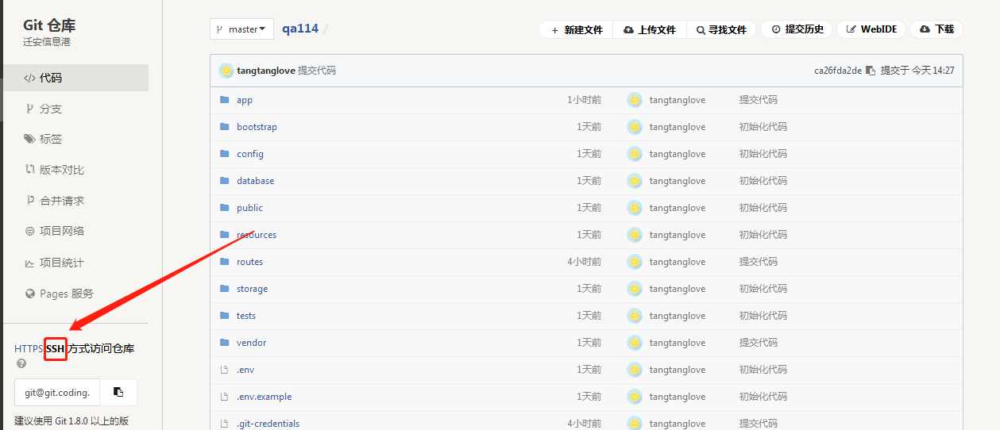
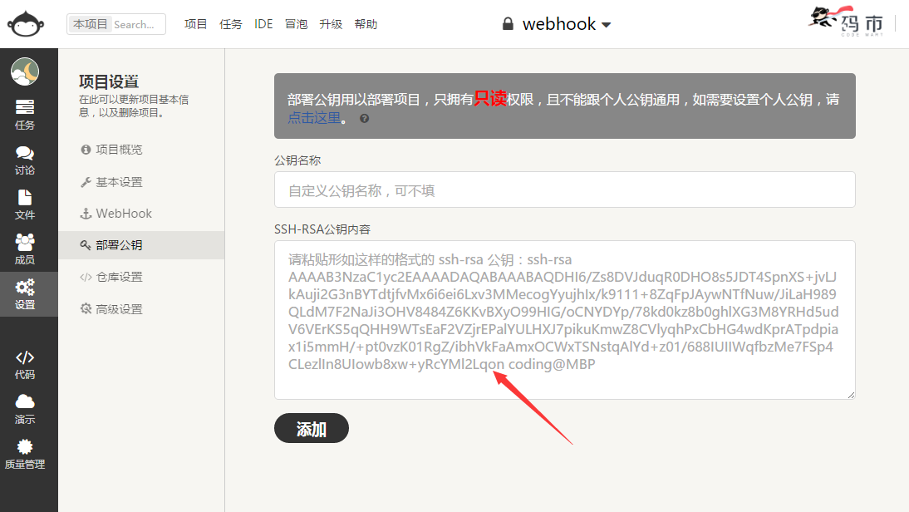
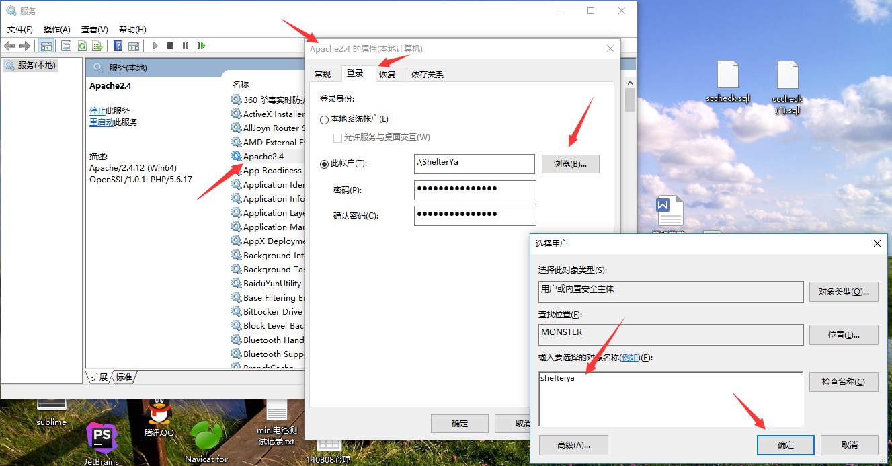

# 常见问题

## 空白页面
**问题：Linux下部署laravel项目出现500服务器错误或者空白页面？**
解决方法：

将项目根目录下的`storage`文件夹设置成可写权限。

## 微信接口

### 1、微信公众号开发接口设置

登录微信公众平台<https://mp.weixin.qq.com/>
AppId：开发者ID(AppID)
Secret：开发者密码(AppSecret)

### 2、微信公众号服务接口设置

Token：令牌(Token)
AesKey：消息加解密密钥(EncodingAESKey)

注意要设置：IP白名单
服务器地址(URL)：<http://www.web.com/wechat/token>

### 3、微信支付接口设置

登录微信商户平台 <https://pay.weixin.qq.com>
下载证书：账户中心->API安全->下载证书，将证书在管理后台上传

MerchantId：商户号
key：账户中心->API安全->设置密钥（自己随机生成32位字符串）

设置支付授权目录：
产品中心->开发配置->JSAPI支付授权目录->添加<http://www.web.com/cashier/>

## 支付宝接口
### 1、支付宝接口设置
登录支付宝开放平台[https://open.alipay.com/platform/home.htm](https://open.alipay.com/platform/home.htm)

应用网关：[http://www.web.com/cashier/alipay/ ](http://www.web.com/cashier/alipay/ )

授权回调地址：<http://www.web.com/cashier/alipay/notifyUrl>

## Linux下Git自动部署

git要配置ssh提交代码
~~~
git remote add origin git@git.coding.net:tangtanglove/qa114.git
~~~
**1.制作ssh rsa key**
~~~
ssh-keygen -t rsa -C "youremail@example.com"
~~~
直接三个回车，可以root\\.ssh目录下看到id_rsa、id_rsa.pub两个文件
在生产密钥成功！

**部署公钥**
`sudo -Hu www ssh-keygen -t rsa` # 请选择 “no passphrase”，一直回车下去
（注意，如果出现：Permission denied (publickey)，请将root\\.ssh目录下的文件复制到/home/www/.ssh目录下。）

**2.配置到远程coding库**

将上面生产的id_rsa.pub，配置到项目coding远程仓库的部署公钥上

**3. 配置coding远程仓库webhook**

webhook地址：http://www.website.com/tools/git/webhook?version=develop (根据实际情况填写)

**第一次拉取代码，完成测试**
`sudo -Hu www git clone -b develop git@git.coding.net:tangtanglove/qa114_com.git /www/web/dev_qa114_com/  --depth=1`

**各种问题解答：**
1.权限问题

linux下需要将**项目目录**下的.git文件权限赋予给你的web服务器的用户组、用户
可以用`chown -R www:www .git`命令（www:www为你web服务器所在的用户组及用户）

2.如果是https需要切换到ssh

命令如下`git remote set-url origin  [ssh的url]` 

3.Could not stat /dev/null/.ssh: Not a directory解决办法

原因是linux下的www用户不存在其主目录，所以要给www用户的主目录新增一个主目录，可以vi /etc/passwd 修改成/home/www,然后在www下建立.ssh目录。

## Winodws下Git自动部署
git的全局环境是执行的 C:\Program Files\Git\cmd\git.exe。需要自行检查添加环境。

git要配置ssh提交代码
~~~
git remote add origin git@git.coding.net:tangtanglove/qa114.git
~~~
**1.制作ssh rsa key**
~~~
ssh-keygen -t rsa -C "youremail@example.com"
~~~
直接三个回车，可以C:\Documents and Settings\username\\.ssh目录下看到id_rsa、id_rsa.pub两个文件
在生产密钥成功！

**2.配置到远程coding库**

将上面生产的id_rsa.pub，配置到项目coding远程仓库的部署公钥上

**3.更改apache服务器的登录用户**

因为 shell_exec()运行git pull的时候，需要去获取上面制作的ssh密钥，因此需要拥有系统登陆账号的权限才能读到C:\Documents and Settings\username\\.ssh目录下的id_rsa、id_rsa.pub

修改apache服务的登录用户即可

**4. 配置coding远程仓库webhook**

webhook地址：http://www.website.com/tools/git/webhook?version=develop (根据实际情况填写)

## Linux下php7.1链接SqlServer
Ubuntu 16.04:
~~~ bash
sudo su 
curl https://packages.microsoft.com/keys/microsoft.asc | apt-key add -
curl https://packages.microsoft.com/config/ubuntu/16.04/prod.list > /etc/apt/sources.list.d/mssql-release.list
exit
sudo apt-get update
sudo ACCEPT_EULA=Y apt-get install -y msodbcsql mssql-tools unixodbc-dev
sudo pecl install sqlsrv
sudo pecl install pdo_sqlsrv
echo "extension=sqlsrv" >> `php --ini | grep "Loaded Configuration" | sed -e "s|.*:\s*||"`
echo "extension=pdo_sqlsrv" >> `php --ini | grep "Loaded Configuration" | sed -e "s|.*:\s*||"`
~~~
CentOS 7:
~~~ bash
sudo su
curl https://packages.microsoft.com/config/rhel/7/prod.repo > /etc/yum.repos.d/mssql-release.repo
exit
sudo yum update
sudo ACCEPT_EULA=Y yum install -y msodbcsql mssql-tools unixODBC-devel 
sudo yum groupinstall "Development Tools"
sudo pecl install sqlsrv
sudo pecl install pdo_sqlsrv
echo "extension=sqlsrv" >> `php --ini | grep "Loaded Configuration" | sed -e "s|.*:\s*||"`
echo "extension=pdo_sqlsrv" >> `php --ini | grep "Loaded Configuration" | sed -e "s|.*:\s*||"`
~~~